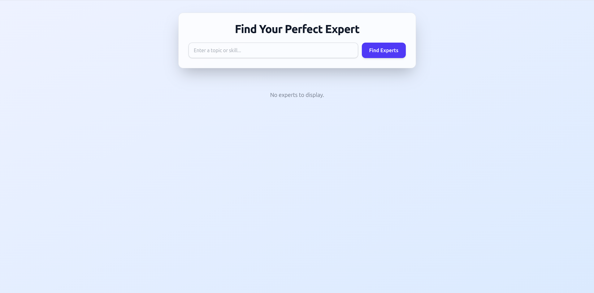
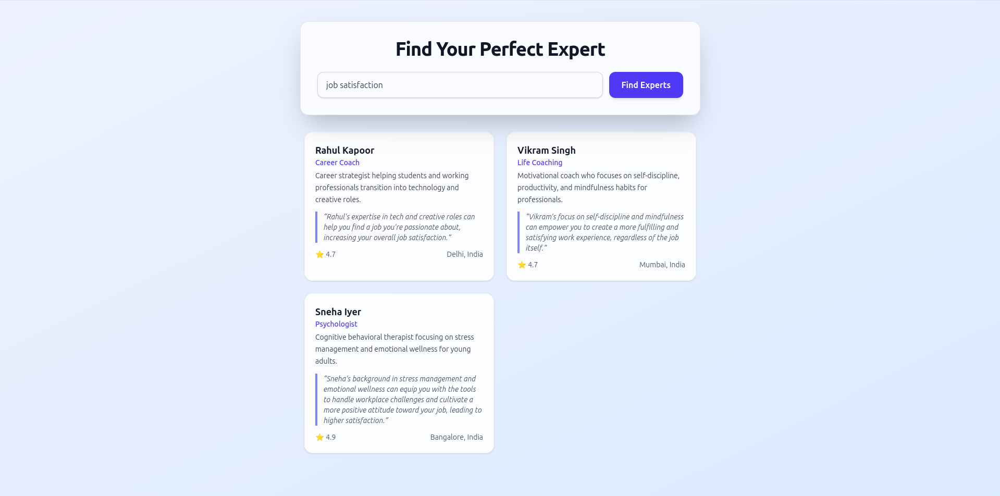

# ground_zero_intern_task_adarsh


## Before You Start
Update the file `/backend/.env` with your own data before you start the project.

## About the Backend
The backend has two versions: **v1** and **v2**.

### Version 1
- Every new request creates a new chat.  
- This makes it slower because the same content is sent again each time.

### Version 2
- There is one common chat that remembers the category name.  
- The `data.json` file is cleaned to only keep the category name.  
- This version is faster but **not safe** because all users share the same global chat.

To make it safe, we can use a **vector database** with **embeddings**.  
This helps reduce extra context data for each new request.

---

## How to Run the Project

### Step 1
Go to the project folder:
```bash
cd ground_zero_intern_task_adarsh
```

### Step 2
Run the setup script:
```bash
node setup_project.js
```

### Step 3
Run the backend (choose one version):
```bash
node run_backend.js v1
```
or
```bash
node run_backend.js v2
```

### Step 4
Open a new terminal.

### Step 5
Run the frontend:
```bash
node run_frontend.js
```

---

## Images
Below are two images related to the project:

  
